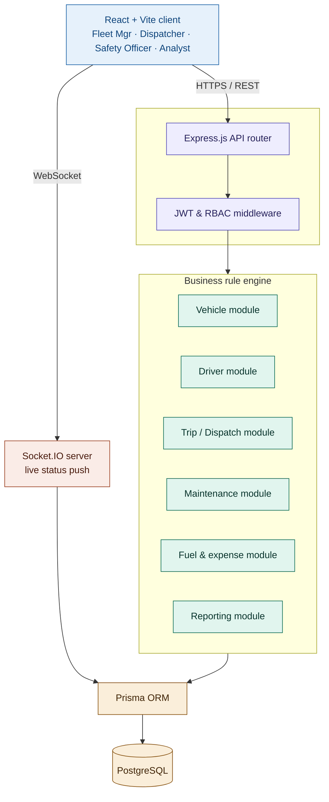
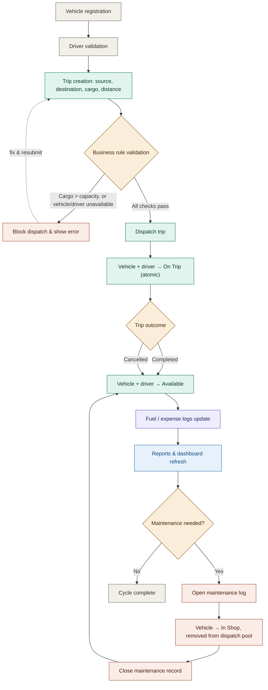

# 🚛 TransitOps — Smart Transport Operations Platform

**A centralized, rule-driven transport operations platform** that digitizes the full lifecycle of fleet assets, driver compliance, dispatch orchestration, and cost analysis — replacing spreadsheets and paper logbooks with a single system of record.

Built for the **Odoo Hackathon**, architected to grow into a production-ready SaaS.

-yellow.svg?style=for-the-badge)

[Problem](#-problem-statement) • [Capabilities](#-platform-capabilities) • [Business Rules](#-mandatory-business-rules) • [Architecture](#-system-architecture) • [Workflow](#-operational-workflow) • [Roles](#-role-matrix) • [Roadmap](#-development-roadmap) • [Team](#-team)

---

## ⚠️ Problem Statement

Logistics operators running a fleet without a unified system of record hit the same wall, over and over:

| Pain Point | Real-World Consequence |
|---|---|
| 🔁 **Scheduling conflicts** | Vehicles/drivers double-booked → idle resources, delayed deliveries |
| 📉 **Underutilized vehicles** | No load-matching visibility → light cargo eats high-capacity vehicles |
| 🔧 **Missed maintenance** | No service-milestone flags → higher breakdown rates, shorter asset life |
| ⚠️ **Expired licenses on the road** | Drivers dispatched with expired/suspended documents → legal & safety liability |
| 💸 **Invisible expense leaks** | Manual logs hide fuel anomalies, pilferage, inflated cost-per-km |
| 🕳️ **No operational visibility** | Managers coordinate blind, without a live dashboard or status alerts |

**TransitOps** exists to close every one of these gaps in a single platform.

---

## 🎯 Product Vision

TransitOps transforms fragmented, spreadsheet-and-paper transport operations into a centralized, **rule-driven** operations platform. A server-side business rule engine enforces compliance, blocks invalid vehicle/driver assignments, monitors maintenance schedules, tracks granular cost elements, and — as the roadmap matures — layers in predictive recommendations.

The goal: shift fleet teams from **reactive firefighting** to **predictive asset coordination**.

---

## ⚙️ Platform Capabilities

| Module | What It Does |
|---|---|
| 🔑 **Authentication & RBAC** | Secure login with Role-Based Access Control across Fleet Manager, Dispatcher, Safety Officer, and Financial Analyst roles — enforced on every route, not just hidden in the UI |
| 📊 **Fleet Dashboard** | Live KPIs — Active/Available/In-Maintenance vehicles, Active/Pending trips, Drivers on Duty, Fleet Utilization % — filterable by type, status, and region |
| 🚛 **Vehicle Registry** | Master list with unique registration number, model, type, max load capacity, odometer, acquisition cost, and status (`Available` / `On Trip` / `In Shop` / `Retired`) |
| 🧑‍✈️ **Driver Management** | Full profiles — license number/category/expiry, contact, safety score, status (`Available` / `On Trip` / `Off Duty` / `Suspended`) |
| 🗺️ **Trip & Dispatch Management** | Source, destination, cargo weight, planned distance; full lifecycle `Draft → Dispatched → Completed / Cancelled` |
| 🔧 **Maintenance Lifecycle** | Opening a service log auto-blocks the vehicle from dispatch; closing it auto-reinstates the asset |
| ⛽ **Fuel & Expense Tracking** | Logs fuel fills and auxiliary expenses (tolls, misc.), dynamically rolling up total operational cost per vehicle |
| 📈 **Reports & Analytics** | Fuel efficiency, fleet utilization, operational cost, and vehicle ROI — CSV export built in |

---

## 🧠 Intelligence Layer (Planned)

What separates TransitOps from a basic CRUD form set — a modular set of intelligence extensions layered on top of the core platform:

| Feature | Description | Status |
|---|---|---|
| **Computed driver safety score** | Dynamic 0–100 score from on-time delivery, fuel anomalies, duty-hour compliance | Planned — Phase 12 |
| **Dispatch recommendation engine** | Ranks best driver-vehicle matches by capacity fit and wear-balancing | Planned — Phase 12 |
| **Predictive maintenance alerts** | Odometer-velocity trend tracking → "Service due soon" before breakdowns | Planned — Phase 12 |
| **Duty-hour compliance** | Blocks dispatch for drivers exceeding rolling 24h driving limits | Planned — Phase 12 |
| **Cost leakage detection** | Flags anomalous cost-per-km spikes (fuel theft, inflated invoices) | Planned — Phase 12 |
| **Compliance document vault** | Tiered alerts for recurring document expiry (insurance, PUC, permits) | Planned — Phase 12 |
| **Natural-language ops assistant** | Conversational interface for fleet managers to query metrics in plain text | Planned — Phase 12 |
| **Live operations map** | Real-time map of active dispatches (mock/simulated GPS) | Planned — Phase 12 |
| **Customer tracking link** | Shareable, tokenized URL for customers to watch live ETAs without logging in | Planned — Phase 12 |

---

## 🛡️ Mandatory Business Rules

Every rule below is enforced **server-side, inside a database transaction** — never left to trust on the client:

1. **Unique registrations** — no two vehicles share a registration number
2. **Dispatch exclusion** — vehicles `In Shop` or `Retired` are blocked from new dispatches
3. **Driver vetting** — expired-license or `Suspended` drivers are blocked from dispatch
4. **No double-booking** — a vehicle or driver already `On Trip` cannot join a second trip
5. **Capacity guard** — cargo weight can never exceed the assigned vehicle's max load
6. **Atomic transitions** — dispatch flips vehicle + driver to `On Trip` together; complete/cancel reverts both together
7. **Maintenance locks** — opening a maintenance record sets the vehicle `In Shop`; closing it restores `Available` (unless `Retired`)

---

## 🏗️ System Architecture

TransitOps is a **modular monolith** for the hackathon build — service boundaries are drawn cleanly enough that any module (Reporting, Dispatch, etc.) can be extracted into its own microservice later with no redesign.

**Layer by layer:**
- **Client** — React 18 + Vite SPA, one interface for all four roles, role-aware routing
- **Edge** — Express router behind JWT + RBAC middleware; every request is authenticated and role-checked before it reaches business logic
- **Core** — six service modules (Vehicle, Driver, Trip/Dispatch, Maintenance, Fuel & Expense, Reporting) sharing one data-access layer, so Dispatch can call Vehicle/Driver for status checks without duplicating logic
- **Real-time** — Socket.IO pushes live status changes (a dispatched trip, a vehicle going `In Shop`) to every connected dashboard instantly
- **Persistence** — Prisma ORM over PostgreSQL as the single system of record; every state transition happens inside a DB transaction

> ⚠️ **Current repo status:** Phase 0 — documentation and standards only. Source code lands in sequential phases per the roadmap below.

---

## 🔄 Operational Workflow

The trip lifecycle is the core rule-enforcement path — the same one used in the demo walkthrough (Vehicle `Van-05` + driver `Alex`):

**Walking it end to end:** Fleet Manager registers `Van-05` (500 kg capacity) → Safety Officer registers driver `Alex` with a valid license → Dispatcher creates a trip with 450 kg cargo → backend validates `450 ≤ 500` and both resources `Available` → trip saved as `Draft` → Dispatch flips both to `On Trip` in one transaction, and they vanish from every other dispatch picker → on delivery, final odometer + fuel are entered → trip closes, both resources return to `Available` → the fuel figure rolls into the vehicle's cost summary → an oil change later pulls `Van-05` into `In Shop` until closed → Financial Analyst's Operational Cost and Fuel Efficiency reports reflect all of it, automatically.

---

## 👥 Role Matrix

| Role | Operational Scope | Access Level |
|---|---|---|
| **Fleet Manager** | Full operational visibility, master registry control | Write on Vehicles/Drivers, read-only on logs |
| **Dispatcher / Driver** | Dispatch actions, execution logging, load weight capture | Write on Trips, Fuel Logs, Expenses |
| **Safety Officer** | Safety scores, license expirations, regulatory compliance | Write on Driver compliance/suspensions |
| **Financial Analyst** | Operating costs, maintenance logs, ROI metrics, exports | Read-only on analytics, CSV export privileges |

---

## 🛠️ Technology Stack (Target)

| Layer | Choice |
|---|---|
| Frontend | React + Vite |
| Backend | Node.js + Express |
| Database | PostgreSQL |
| ORM | Prisma |
| Real-time | Socket.IO |
| Auth | JWT (access + refresh) + bcrypt |

---

## 📋 Feature Status Matrix

| Feature Module | Type | Status | Phase |
|---|---|---|---|
| Project documentation | Foundation | ✅ Implemented | Phase 0 |
| Codebase setup & Prisma config | Foundation | ⏳ Planned | Phase 1 |
| Authentication & RBAC checks | Mandatory | ⏳ Planned | Phase 2 |
| KPI fleet dashboard | Mandatory | ⏳ Planned | Phase 3 |
| Vehicle registry CRUD | Mandatory | ⏳ Planned | Phase 4 |
| Driver management CRUD | Mandatory | ⏳ Planned | Phase 5 |
| Trip dispatch lifecycle | Mandatory | ⏳ Planned | Phase 6 |
| Business rule checks | Mandatory | ⏳ Planned | Phase 7 |
| Maintenance records | Mandatory | ⏳ Planned | Phase 8 |
| Fuel & expense calculations | Mandatory | ⏳ Planned | Phase 9 |
| Analytics reports & CSV export | Mandatory | ⏳ Planned | Phase 10 |
| Bidirectional WebSocket sync | Bonus | ⏳ Planned | Phase 11 |
| Driver safety score, recommendation engine, predictive maintenance, duty-hour checks, cost-leakage detection, document vault, NL assistant, live map, tracking link | Advanced differentiator | ⏳ Planned | Phase 12 |

---

## 🚀 Development Roadmap

| Phase | Focus |
|---|---|
| **Phase 0** *(active)* | Repository documentation and standards |
| **Phases 1–2** | Project foundation, Auth & RBAC middleware |
| **Phases 3–6** | Vehicle, driver, and trip-dispatch registries & lifecycles |
| **Phase 7** | Business rule engine — capacity & availability validation |
| **Phases 8–10** | Maintenance, expense logs, CSV reporting |
| **Phases 11–13** | WebSockets, intelligence layer, deployment & Cypress test suites |

Full acceptance checklists per phase live in `docs/ROADMAP.md`.

---

## 📁 Repository Structure

---

## 👥 Team

- **Nasir Yousuf** — Team Lead / Core Developer
- **Faishal Imtiaz** — Core Developer
- **Mohd Ayan** — Core Developer
- **Maaz Zaki** — Core Developer

---

## 🤝 Contributing

All contributions go through pull-request review — direct pushes to `main` are not permitted. Branch naming and commit conventions are documented in `CONTRIBUTING.md`.

---

## 📄 License

